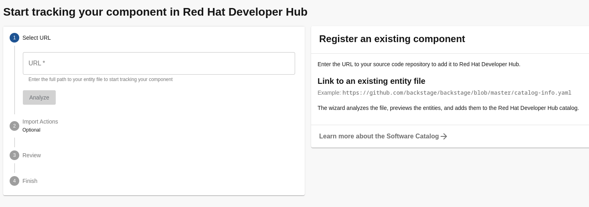

# rhdh-exercises

## Mandatory settings 

When Red Hat Developer Hub is installed via the operator there are some mandatory settings that need to be set.

- create mandatory backend secret
- add the `basedomain` to enable proper navigation and cors settings

```sh
oc apply -f ./custom-app-config-gitlab/rhdh-secrets.yaml -n rhdh-gitlab
export basedomain=$(oc get ingresscontroller -n openshift-ingress-operator default -o jsonpath='{.status.domain}' | base64 -w0)
oc patch secret rhdh-secrets -n rhdh-gitlab -p '{"data":{"basedomain":"'"${basedomain}"'"}}'
```

Enable custom and external application configuration adding this `configmap` and `secret` to the rhdh manifest:

```yaml
spec:
  application:
    appConfig:
      configMaps:
      - name: app-config-rhdh
    extraEnvs:
      secrets:
        - name: rhdh-secrets       
```

or run this:

```sh
oc apply -f ./custom-app-config-gitlab/rhdh-app-configmap.yaml -n rhdh-gitlab
oc apply -f ./custom-app-config-gitlab/rhdh-instance.yaml -n rhdh-gitlab
```

## Enable gitlab authentication

Create a [new application](https://backstage.io/docs/auth/gitlab/provider):

- the call back uri should look something like: `https://backstage-developer-hub-rhdh-gitlab.${OCP_CLUSTER_DOMAIN}/api/auth/gitlab/handler/frame`
- set the correct permissions: `read_user`, `read_repository`, `write_repository`, `openid`, `profile`, `email`

Create a secret with a app id and secret

```yaml
kind: Secret
apiVersion: v1
metadata:
  name: gitlab-secrets
  namespace: rhdh-gitlab
stringData:
  AUTH_GITLAB_CLIENT_ID: REPLACE_WITH_YOUR_GITLAB_CLIENT_ID
  AUTH_GITLAB_CLIENT_SECRET: REPLACE_WITH_YOUR_GITLAB_CLIENT_SECRET
type: Opaque
```

You can create the `gitlab-secrets.yaml` inside of `custom-app-config-gitlab` folder an run:

```sh
oc apply -f ./custom-app-config-gitlab/gitlab-secrets.yaml -n rhdh-gitlab
```

Modify app-config with environment variables from the new secret:

```yaml
    app:
      title: Red Hat Developer Hub
    signInPage: gitlab
    auth:
      environment: development
      providers:
        gitlab:
          development:
            clientId: ${AUTH_GITLAB_CLIENT_ID}
            clientSecret: ${AUTH_GITLAB_CLIENT_SECRET}
```

Notice that we set the `signInPage` to gitlab, the default is github.

To disable guest login set the environment to production add the new secret to the backstage manifests:

```yaml
spec:
  application:
    ...
    extraEnvs:
      secrets:
        - name: gitlab-secrets
```

or execute:

```sh
oc apply -f ./custom-app-config-gitlab/rhdh-app-configmap-1.yaml -n rhdh-gitlab
oc apply -f ./custom-app-config-gitlab/rhdh-instance-1.yaml -n rhdh-gitlab
```

Verify that you can login with GitLab.

## Enable gitlab plugin integration

Create new PAT with [these permissions](https://backstage.io/docs/integrations/gitlab/locations) and add the
PAT to the previously created `gitlab-secrets` secret:

```yaml
kind: Secret
apiVersion: v1
metadata:
  name: gitlab-secrets
  namespace: rhdh-gitlab
stringData:
  AUTH_GITLAB_CLIENT_ID: REPLACE_WITH_YOUR_GITLAB_CLIENT_ID
  AUTH_GITLAB_CLIENT_SECRET: REPLACE_WITH_YOUR_GITLAB_CLIENT_SECRET
  GITLAB_TOKEN: REPLACE_WITH_YOUR_PAT
type: Opaque
```

Add the following to the app-config configmap:

```yaml
kind: ConfigMap
apiVersion: v1
metadata:
  name: app-config-rhdh
data:
  app-config-rhdh.yaml: |
    app:
      title: Red Hat Developer Hub
    integrations:
      gitlab:
        - host: gitlab.${basedomain}
          token: ${GITLAB_TOKEN}
          apiBaseUrl: https://gitlab.${basedomain}/api/v4
          baseUrl: https://gitlab.${basedomain}          
```      

Or execute:

```sh
oc apply -f ./custom-app-config-gitlab/rhdh-app-configmap-2.yaml -n rhdh-gitlab
```

## Add gitlab autodiscovery

Create a new configmap with the needed dynamic plugin

```sh
oc apply -f ./custom-app-config-gitlab/dynamic-plugins-3.yaml -n rhdh-gitlab
```

Add this to the app config configmap:

```yaml
catalog:
  providers:
    gitlab:
      yourProviderId:
        host: gitlab.${basedomain} # Identifies one of the hosts set up in the integrations
        apiBaseUrl: https://gitlab.${basedomain}/api/v4
        branch: main # Optional. Used to discover on a specific branch
        fallbackBranch: main # Optional. Fallback to be used if there is no default branch configured at the Gitlab repository. It is only used, if `branch` is undefined. Uses `master` as default
        skipForkedRepos: false # Optional. If the project is a fork, skip repository
        entityFilename: catalog-info.yaml # Optional. Defaults to `catalog-info.yaml`
        projectPattern: '[\s\S]*' # Optional. Filters found projects based on provided patter. Defaults to `[\s\S]*`, which means to not filter anything
        schedule: # optional; same options as in TaskScheduleDefinition
          # supports cron, ISO duration, "human duration" as used in code
          frequency: { minutes: 1 }
          # supports ISO duration, "human duration" as used in code
          timeout: { minutes: 3 }
```

Or execute:

```sh
oc apply -f ./custom-app-config-gitlab/rhdh-app-configmap-3.yaml -n rhdh-gitlab
```

Update the backstage manifest to use the new configmap for plugins:

```yaml
spec:
  application:
  ...
    dynamicPluginsConfigMapName: dynamic-plugins-rhdh
```

Or run:

```sh
oc apply -f ./custom-app-config-gitlab/rhdh-instance-3.yaml -n rhdh-gitlab
```

Verify that the `sample-service` component is in the application catalog.

## Enable users/teams autodiscovery

Add this to the configmap:

```yaml
  catalog:
    providers:
      gitlab:
        yourProviderId:
          host: gitlab.${basedomain}
          orgEnabled: true
          group: org/teams # Required for gitlab.com when `orgEnabled: true`. Optional for self managed. Must not end with slash. Accepts only groups under the provided path (which will be stripped)
          groupPattern: '[\s\S]*'
```

Or run:

```sh
oc apply -f ./custom-app-config-gitlab/rhdh-app-configmap-4.yaml -n rhdh-gitlab
```

**ATTENTION**: This step is broken due to this [issue](https://issues.redhat.com/browse/RHIDP-1713).
We will emulate what the processor would have done by uploading the users-groups.yaml to backstage:



verify that users and teams are discovered

## Enable RBAC

Enable permissions by updating app-config

```yaml
permission:
  enabled: true
  rbac:
    admin:
      users:
        - name: user:default/1   
    policies-csv-file: /permissions/rbac-policy.csv
```

Mount the new file in the backstage manifests:

```yaml
    extraFiles:
      mountPath: /opt/app-root/src
      configMaps:
        - name: rbac-policy
          key: rbac-policy.csv
```

Create a new permission file, see [`permission-configmap-5.yaml`](./custom-app-config-gitlab/permission-configmap-5.yaml) file.

```sh
oc apply -f ./custom-app-config-gitlab/permission-configmap-5.yaml -n rhdh-gitlab
oc apply -f ./custom-app-config-gitlab/rhdh-app-configmap-5.yaml -n rhdh-gitlab
oc apply -f ./custom-app-config-gitlab/rhdh-instance-5.yaml -n rhdh-gitlab
```

Verify that user2 cannot see `sample-service` anymore.
